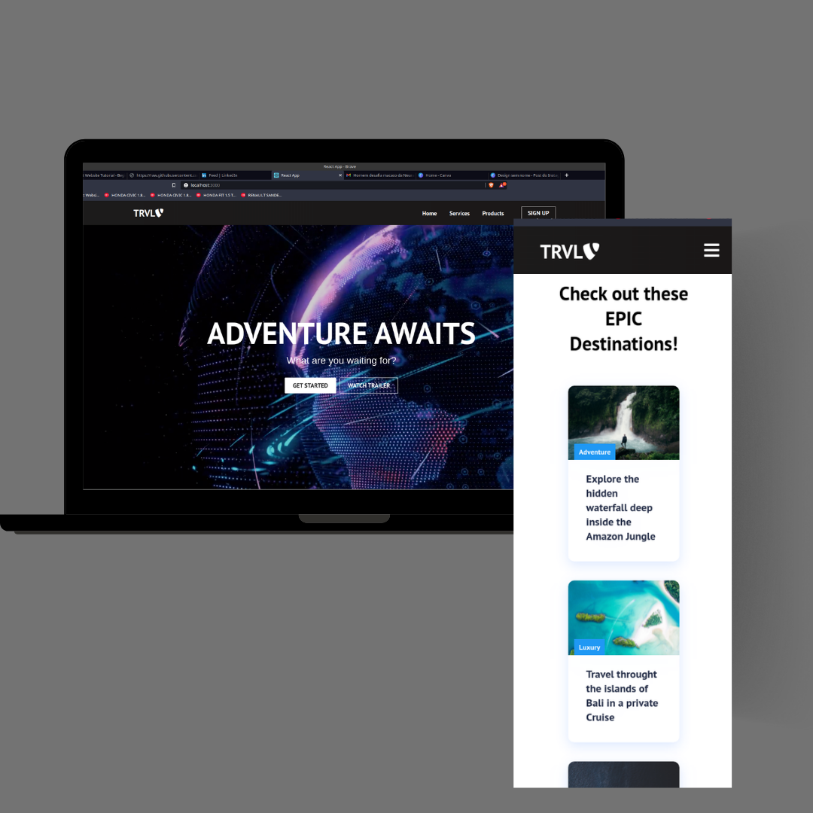

## Travel Web Site

<h4 align="center">
  TRVL is a platform to find the best and most exciting trips.
</h4>



## Tecnologies

<div align="center">
  <br />
  
</div>

this project was developed using front end technologys 

- [ReactJS](https://reactjs.org/)

## 💻 Getting started

### Requirements

**Follow the steps below**

```bash
# Install the dependencies
$ npm -i

# Run the project
$ yarn start


The app will be available for access on your browser at `http://localhost:3000`

## 📝 License

This project is licensed under the MIT License - see the [LICENSE](LICENSE) file for details.

---

Made with 💜 by Samuel Ferreira 👋 [Check out my LinkedIn](https://www.linkedin.com/in/samuel-ferreira-de-oliveira-costa-0b32b8178/)